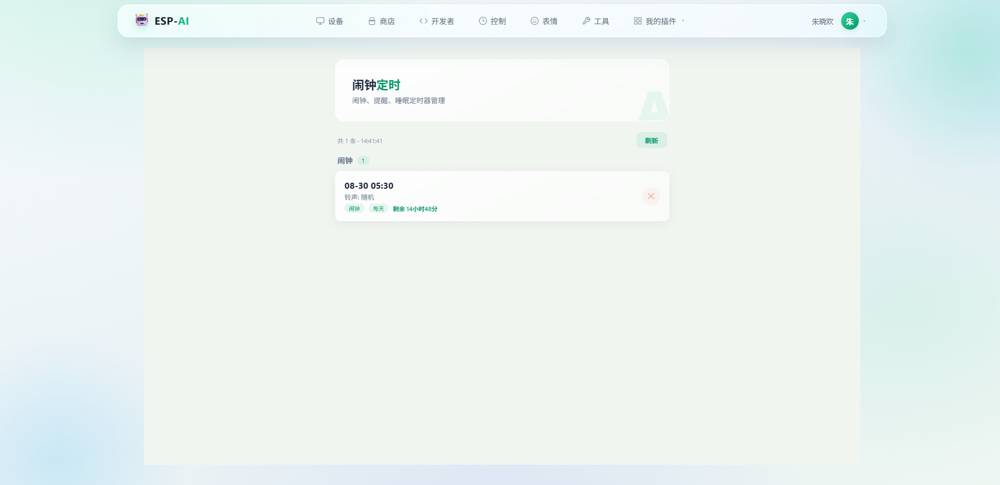

<div align="center">

# 小明同学 · ESP32 全栈开源语音助手



**真实案例**：面包板 + ESP32-S3 + INMP441 麦克风 + 1.54" 表情屏，正在待机等待唤醒

**一块 ESP32 开发板 + 几十元元器件，复刻一台会聊天、会成长、能被微信唤醒的 AI 桌面伴侣**

固件 · 服务端 · Web 控制台 · 手机 App · 文档站 —— 五端全开源，从面包板到上架插件商店的完整链路

</div>

---

## 它能做到什么

对它说"小明同学"，它会回应"我在呢"，然后：

- **实时语音对话** — 流式 ASR → LLM → TTS 全链路流水线，边说边识别、边生成边播报，随时打断
- **越用越懂你** — 自动从对话中提炼长期记忆、用户画像、情绪日记，甚至自己学会新技能（自学习）
- **一切皆插件** — 天气、音乐、闹钟是插件；ASR/LLM/TTS 也可以是插件。第三方插件跑在独立沙箱进程里，市场一键安装
- **多端控制** — Web 控制台 + 手机 App + 微信聊天，三个入口管同一台设备
- **它会主动找你** — AI 自主决定何时找你聊天（每日限次），闹钟到点用任意音色播报，设备离线微信提醒你

一通典型对话的旅程：

```
你说："小明同学，明天早上七点叫我起床"
  ↓ 唤醒词检测（设备端 WakeNet，离线）
  ↓ 麦克风音频流 ──WebSocket──→ 服务端
  ↓ 流式 ASR 识别："明天早上七点叫我起床"
  ↓ LLM 理解 → 调用 set_alarm 工具 → 回复"好，明早七点准时叫你"
  ↓ TTS 合成 MP3 ──流式下发──→ 设备播放
  ↓ 自动回到聆听状态，等你下一句
```

## 五端全开源

| 模块 | 技术栈 | 说明 |
|---|---|---|
| [esp-ai-idf-client](esp-ai-idf-client/) | ESP-IDF · C | 设备固件：BLE 配网、离线唤醒、I2S 音频、LVGL 表情屏、OTA |
| [esp-ai-server](esp-ai-server/) | FastAPI · asyncio | 语音后端：4-Worker 流式管线、插件沙箱、记忆/成长系统、多设备管理 |
| [esp-ai-web](esp-ai-web/) | Vue3 · Vite | 浏览器控制台：设备/技能/插件商店/表情/MCP/开发者工具 |
| [esp-ai-app](esp-ai-app/) | uni-app | 手机 App（iOS/Android）：BLE 配网、设备控制、商店 |
| [vuepress-starter](vuepress-starter/) | VuePress | 文档站：用户指南 + 服务端开发 + 插件开发教程 |

## 核心亮点

### 为低延迟而生的流式架构

4-Worker 并发管线（LLM → 分句 → TTS → 发送）+ 三级背压队列：LLM 边生成边分句，首句凑齐立即送 TTS，音频按播放速率节流下发——首响延迟压到秒级，长回答也不卡顿。ASR/LLM/TTS 三段全部流式，支持连续多轮对话与随时打断。

### 一切皆插件

插件就是一段 Python + 一个 manifest.json：

- **工具插件**：`@tool()` 一个装饰器注册为 LLM 可调用的能力，配 KV 存储/HTTP/设备指令等 SDK
- **服务插件**：连 ASR/LLM/TTS 供应商都能被插件替换——安装即切换全设备的语音引擎
- **带 UI 的插件**：`frontend/` 目录放一个 HTML，自动出现在主应用导航里
- **沙箱隔离**：市场安装的插件跑在独立子进程，import 白名单 + 权限裁决 + SSRF 防护 + 超时强杀，恶意代码出不了沙箱

配套完整的插件开发教程与 SDK 文档，不改一行框架代码就能扩展生态。

### 会成长的 AI

这是大多数 DIY 语音助手没有的部分：

- **长期记忆**：对话内容自动提炼成摘要标签，下次聊天主动想起"你上次说…"
- **用户画像**：名字、职业、喜好持续积累，回复越来越个性化
- **情绪日记**：每天一篇 AI 日记，记录设备的"心情"和你们的故事
- **自学习**：从对话中总结出新技能（SKILL.md），自动注册为可调用能力
- **主动陪伴**：LLM 自主决定何时主动开口，而非永远被动应答

### 生产级工程

JWT 多用户鉴权与设备归属校验、字段级加密存储、Prometheus 监控、限流、OTA 固件生命周期管理、插件签名与完整性校验、2700+ 单元测试与 CI——不是玩具 demo，是可以长期挂在家里跑的系统。

## 硬件成本

面包板就能跑起来，整机元器件约几十元：

| 板型 | 芯片 | 屏幕 |
|---|---|---|
| 面包板（最简） | ESP32-S3 | 无屏幕 |
| 面包板 + 1.54" LCD | ESP32-S3 | ST7789 240×240 表情屏 |
| ESP32-C3 SuperMini | ESP32-C3 | 无屏幕（ES8311 音频方案） |

**音频方案**：INMP441 数字麦克风 + MAX98357 功放（I2S 直连），或 ES8311 编解码器 + NS4150B。完整接线图见[文档站](vuepress-starter/docs/guide/client/wiring.md)。

## 快速复刻

```bash
# 1. 固件：编译烧录到 ESP32（板型/音频方案 menuconfig 可选）
cd esp-ai-idf-client        # 详见其 README 与文档站接线图

# 2. 服务端：配好 ASR/LLM/TTS 的 Key 即可跑
cd esp-ai-server
uv sync && cp .env.example .env
python src/main.py           # 端口 8088

# 3. Web 控制台
cd esp-ai-web && npm install && npm run dev

# 4. 手机 App：HBuilderX 导入 esp-ai-app，BLE 配网绑定设备

# 5. 本地文档站（可选）
cd vuepress-starter && npm install && npm run docs:dev
```

云服务侧需要一个 LLM API Key（DeepSeek/GPT 等 OpenAI 兼容接口均可）+ 一个语音服务账号（火山引擎等）；ASR/LLM/TTS 也都可以通过插件接入任意供应商。

## 文档

完整文档在 [vuepress-starter](vuepress-starter/docs/)（`npm run docs:dev` 本地预览）：

- **用户指南**：快速开始、接线图、烧录固件、App 操作
- **服务端开发**：配置、会话引擎、Pipeline、记忆/技能系统、数据库、WebSocket 协议
- **插件开发**：从零写一个插件、SDK API 参考、权限与沙箱、生命周期与事件

## 项目结构

```
esp32-xiaoming/
├── esp-ai-idf-client/    # ESP32 固件（ESP-IDF）
├── esp-ai-server/        # 语音后端（FastAPI）
├── esp-ai-web/           # Web 控制台（Vue3）
├── esp-ai-app/           # 手机 App（uni-app）
└── vuepress-starter/     # 文档站（VuePress）
```

## 许可证

各子项目均为 MIT License。
