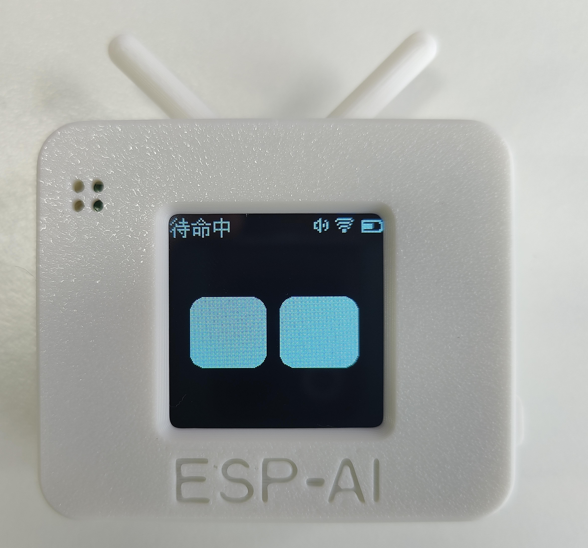
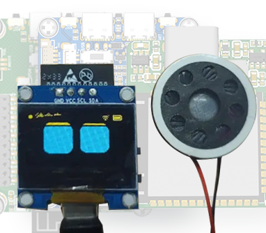

<div align="center">

# ESP-AI Server

基于 FastAPI + asyncio 构建的 ESP-AI 智能语音后端服务，为 ESP32 等硬件设备提供完整的语音交互解决方案。采用全链路流式处理架构，实现语音识别 → 大模型对话 → 语音合成的低延迟实时交互。

[](https://www.python.org/)
[](https://fastapi.tiangolo.com/)

[中文文档](https://espai.fun/)


</div>

## 项目介绍

<div align="center">
  
</div>

ESP-AI Server 是一个面向硬件设备的实时语音交互后端，核心设计理念是 **低延迟流式处理** 与 **稳定连接管理**。通过精心设计的异步任务调度和会话状态机，确保多用户场景下从语音识别到语音输出的全链路流畅运行。

### 核心特点

- **全链路流式处理** — ASR 实时识别、LLM 流式生成、TTS 逐句合成与发送，端到端延迟极低
- **ASR + TTS 双预连接** — WebSocket 提前握手，省去识别/合成启动时的数百毫秒延迟
- **用户打断 + 工具打断** — 全链路 `cancel_event` 信号，中断后零残留后台合成
- **会话状态机管理** — 基于状态机精确控制唤醒→识别→合成→播放→下一轮的完整对话周期
- **智能流量控制** — 根据设备缓冲区使用率动态调整音频发送速率，防止设备缓冲区溢出
- **多厂商 ASR 支持** — 内置腾讯云、阿里云、字节跳动、讯飞四家 ASR 服务，工厂模式一键切换
- **Function Calling 工具生态** — 11 个内置工具（音量、音乐、待机等）+ MCP 外部工具扩展
- **生产级运维** — 设备鉴权、请求限流、优雅退出、结构化日志、健康检查端点
- **多设备并发隔离** — 每个连接独立的工具上下文，channel 不串扰
- **插件化可扩展** — ASR / LLM / TTS 均采用基类 + 工厂模式，新增厂商只需实现接口

## 硬件展示

<p align="center">
  
  
</p>

<p align="center">
  
  
</p>

---

## 功能特性

- **语音识别 (ASR)**：支持腾讯云、阿里云、字节跳动、讯飞等多家 ASR 服务，工厂模式切换
- **大模型对话 (LLM)**：支持 OpenAI 兼容接口，可配置 DeepSeek、GPT 等模型
- **语音合成 (TTS)**：火山引擎 TTS 流式逐句合成，WebSocket 长连接复用，首句延迟 < 500ms
- **流式 Pipeline**：LLM 输出实时分句 → 并行预连 TTS → 顺序合成 → 流式发送，全链路无缝衔接
- **WebSocket 实时通信**：支持设备端实时语音交互，含心跳保活与流量控制
- **工具调用 (Function Calling)**：内置 11 个工具（音量调节、音乐播放、待机模式、MCP 扩展等）
- **设备鉴权**：可配置 URL key 验证，防止未授权设备连接
- **请求限流**：滑动窗口限流，保护 API 额度不被异常调用消耗
- **优雅退出**：SIGTERM 时等待活跃连接完成，不暴力断连
- **结构化日志**：支持彩色控制台 / JSON 两种输出格式，方便本地调试和日志采集

## 快速开始

### 1. 安装 UV 包管理器

#### Windows

```powershell
Set-ExecutionPolicy -ExecutionPolicy RemoteSigned -Scope CurrentUser
Invoke-RestMethod -Uri https://astral.sh/uv/install.ps1 -OutFile install.ps1
./install.ps1
```

#### macOS/Linux

```bash
curl -LsSf https://astral.sh/uv/install.sh | sh
```

### 2. 拉取项目代码

```bash
git clone https://gitee.com/zhuxiaohuaqn/esp-ai-server.git
```

### 3. 同步项目依赖

```bash
cd espai-server
uv sync
```

### 4. 配置环境变量

```bash
# 复制环境变量模板
cp .env.example .env

# 编辑 .env，填入你的 API 密钥
```

### 5. 启动服务

```bash
python src/main.py
```

服务将在 `http://0.0.0.0:8088` 启动。健康检查：

```bash
curl http://localhost:8088/health/live
# {"code":0,"message":"ok","data":{"status":"alive"}}
```

就绪检查（验证 ASR/LLM/TTS 网关与设备注册表是否就绪）：

```bash
curl http://localhost:8088/health/ready
# 关键组件未就绪时返回 HTTP 503
```

交互式 API 文档：

- Swagger UI：`http://localhost:8088/docs`
- ReDoc：`http://localhost:8088/redoc`

---

## Docker 部署

项目自带多阶段 `Dockerfile` 和 `docker-compose.yml`，开箱即用。

### 1. 准备配置

```bash
cp .env.example .env
# 编辑 .env 填入 ASR/LLM/TTS 密钥
cp users.example.json users.json
# 按需编辑多设备配置
```

### 2. 构建并启动

```bash
docker compose up -d --build
```

容器内入口为 `uvicorn src.main:app --host 0.0.0.0 --port 8088`，暴露 `8088` 端口，并内置 `HEALTHCHECK`（访问 `/health/live`）。

### 3. 持久化卷

`docker-compose.yml` 已挂载以下卷，确保数据不随容器销毁：

| 卷 | 容器路径 | 用途 |
|---|---|---|
| `./users.json` | `/app/users.json` | 设备配置（运行时可写，不能 `:ro`） |
| `esp-ai-data` | `/app/src/data` | 日记、记忆、用户画像 |
| `esp-ai-firmware` | `/app/src/firmware` | OTA 固件文件 |
| `esp-ai-logs` | `/app/logs` | 运行日志 |

### 4. 查看日志与状态

```bash
docker compose logs -f esp-ai-server
docker compose ps
```

资源限制默认 2G 内存 / 2 CPU，可在 `docker-compose.yml` 的 `deploy.resources` 中调整。

---

## 配置说明

所有配置通过 `.env` 环境变量管理，`src/infrastructure/config.py` 零硬编码密钥。完整模板见 `.env.example`。

### 服务器基础配置

```bash
HOST=0.0.0.0                # 监听地址
PORT=8088                   # 监听端口
LOG_FORMAT=console          # 日志格式：console（彩色）| json（结构化）
DEBUG_LOG=false             # 是否输出 DEBUG 日志
```

### CORS 跨域配置

控制浏览器前端能否跨域调用 REST API，由 `src/infrastructure/web.py` 的 `CORSMiddleware` 读取。

```bash
# 逗号分隔的来源列表，* 表示允许所有来源（仅建议开发环境使用）
CORS_ORIGINS=*
# 生产环境建议限定具体域名：
# CORS_ORIGINS=https://admin.example.com,https://app.example.com
```

未配置时默认 `*`（允许所有来源）。生产环境务必收紧到具体域名。

### 认证配置

认证分两条链路，由 `src/infrastructure/security.py` 统一校验：

```bash
AUTH_ENABLED=true           # 总开关：true 启用认证，false 放行所有 REST API（仅 WARNING 日志）
AUTH_API_KEY=your-device-key   # 设备 WebSocket 连接密钥（URL ?key= 参数）
ADMIN_API_KEY=your-admin-key   # 管理后台专用密钥（建议与 AUTH_API_KEY 区分）
```

**设备 WebSocket 连接**：在 URL 上携带 `?key=<AUTH_API_KEY>`：

```
ws://192.168.1.100:8088/?key=your-device-key
```

**REST API 调用**：在请求头携带 `X-API-Key` 或 `Authorization: Bearer`：

```bash
curl -H "X-API-Key: your-admin-key" http://localhost:8088/api/devices
# 或
curl -H "Authorization: Bearer your-admin-key" http://localhost:8088/api/devices
```

受保护的接口包括设备控制、技能管理、MCP 配置、表情包管理等。`ADMIN_API_KEY` 与 `AUTH_API_KEY` 均可认证通过；建议管理后台只用 `ADMIN_API_KEY`，设备只用 `AUTH_API_KEY`，便于后续审计与回收。

### ASR 语音识别

```bash
ASR_PROVIDER=tencent        # 厂商：tencent | aliyun | bytedance | xunfei
ASR_TENCENT_APP_ID=         # 腾讯云 AppId
ASR_TENCENT_SECRET_ID=      # 腾讯云 SecretId
ASR_TENCENT_SECRET_KEY=     # 腾讯云 SecretKey
ASR_TENCENT_ENGINE=16k_zh   # 引擎类型
ASR_NO_SPEECH_TIMEOUT=5     # 无人说话超时退出（秒）
ASR_SILENCE_TIMEOUT=2       # 说话后静默超时进入 LLM（秒）
```

### LLM 大模型     

```bash
LLM_API_KEY=sk-xxx             # API Key
LLM_BASE_URL=https://api.deepseek.com/v1
LLM_MODEL=deepseek-v4-flash
```

### TTS 语音合成（火山引擎）

```bash
TTS_VOLCENGINE_API_KEY=        # 火山引擎 API Key
TTS_VOLCENGINE_RESOURCE_ID=seed-tts-1.0
TTS_VOLCENGINE_VOICE_TYPE=zh_female_wanwanxiaohe_moon_bigtts
TTS_VOLCENGINE_SPEED=1.0       # 语速 0.5~2.0
TTS_VOLCENGINE_VOLUME=1.0      # 音量 0.5~2.0
TTS_VOLCENGINE_PITCH=1.0       # 音调 0.5~2.0
```

### 请求限流

```bash
RATE_LIMIT_MAX_RPM=0       # 每设备每分钟 LLM 调用上限，0=不限
```

### 优雅退出

```bash
SHUTDOWN_GRACE_PERIOD=5    # SIGTERM 后等待活跃连接完成的秒数
```

### 多用户独立配置（可选）

如果你想为不同设备分配不同的 LLM Key、音色、System Prompt 或限流策略，创建 `users.json`（已加入 `.gitignore`）：

```bash
cp users.example.json users.json
```

```json
{
  "devices": {
    "D8:3B:DA:6D:D9:3C": {
      "name": "客厅设备",
      "key": "alice-key-123",
      "asr_provider": "tencent",
      "asr_config": {
        "tencent": {
          "app_id": "1252924679",
          "secret_id": "AKID-alice-xxx",
          "secret_key": "wkMly-alice-xxx",
          "engine_model_type": "16k_zh"
        }
      },
      "llm_type": "openai",
      "llm": {
        "api_key": "sk-alice-xxx",
        "base_url": "https://api.deepseek.com/v1",
        "model": "deepseek-v4-flash",
        "system_prompt": "你是小红，活泼可爱的语音助手。",
        "memory_enabled": true,
        "memory_max_messages": 20
      },
      "tts_type": "volcengine",
      "tts_config": {
        "api_key": "alice-tts-key",
        "resource_id": "seed-tts-1.0",
        "voice_type": "zh_female_wanwanxiaohe_moon_bigtts",
        "speed_ratio": 1.1,
        "volume_ratio": 1.0
      },
      "mcp_servers": {
        "amap-maps": {
          "type": "streamable_http",
          "url": "https://mcp.api-inference.modelscope.net/xxx/mcp"
        }
      },
      "rate_limit_rpm": 20
    },
    "A1:B2:C3:D4:E5:F6": {
      "name": "卧室设备",
      "key": "bob-key-456",
      "llm_type": "openai",
      "llm": {
        "api_key": "sk-bob-xxx",
        "model": "gpt-4o",
        "system_prompt": "你是小蓝，卧室的语音管家。"
      },
      "tts_type": "volcengine",
      "tts_config": {
        "voice_type": "zh_male_qingrun"
      },
      "rate_limit_rpm": 10
    }
  }
}
```

> **设备标识**：外层 key（如 `D8:3B:DA:6D:D9:3C`）为设备 MAC 地址，内部 `key` 为设备连接时的鉴权凭证。API 调用时使用 MAC 地址作为 `device_id`，不会暴露 `key`。

**支持的设备配置字段**：

| 配置块 | 字段 | 说明 |
|---|---|---|
| `name` | `"客厅设备"` | 设备名称（API 返回） |
| `key` | `"alice-key-123"` | 连接鉴权 key（WebSocket `?key=xxx`） |
| `asr_provider` | `"tencent"` / `"aliyun"` / ... | 选择 ASR 厂商（未填继承 `.env`） |
| `asr_config` | `{ "tencent": { app_id, secret_id, ... } }` | 厂商全量配置（key 为厂商名） |
| `llm_type` | `"openai"` | 选择 LLM 类型（未填继承 `.env`） |
| `llm` | `api_key`, `base_url`, `model`, `system_prompt`, `memory_enabled`, `memory_max_messages` | LLM 参数覆盖 |
| `tts_type` | `"volcengine"` / `"baidu"` | 选择 TTS 厂商（未填继承 `.env`） |
| `tts_config` | `{ api_key, resource_id, voice_type, speed_ratio, ... }` | TTS 全量配置 |
| `mcp_servers` | `{ "服务名": { type, url } }` | 每设备独立的 MCP 外部工具 |
| `rate_limit_rpm` | 整数 | 每分钟 LLM 调用上限 |

> **配置优先级**：`users.json` 字段 > `.env` 全局默认。未填字段自动继承全局，无需重复。

> **MCP 策略**：每个设备在 `users.json` 中独立配置自己的 `mcp_servers`，不共享。


---

## MCP 外部工具配置

MCP (Model Context Protocol) 允许连接外部工具服务。在 `users.json` 中每个用户独立配置：

```json
{
  "users": {
    "alice-key": {
      "mcp_servers": {
        "amap-maps": {
          "type": "streamable_http",
          "url": "https://mcp.api-inference.modelscope.net/xxx/mcp"
        },
        "12306-mcp": {
          "type": "streamable_http",
          "url": "https://mcp.api-inference.modelscope.net/yyy/mcp"
        }
      }
    }
  }
}
```

支持自定义 headers / auth：

```json
{
  "some-service": {
    "type": "streamable_http",
    "url": "https://api.example.com/mcp",
    "headers": {"Authorization": "Bearer xxx"},
    "auth": "bearer"
  }
}
```

启动后查看日志确认连接成功：

```
[INFO] [MCP Client] 已连接 amap-maps，发现 8 个工具
[INFO] [ToolManager] MCP 外部工具: 8 个，总计: 19 个
```

---

## 内置工具

启动时自动从 `src/use_cases/builtin_tools.py` 和 `src/use_cases/custom/` 目录发现工具：

| 工具名 | 功能 |
|---|---|
| `get_current_time` | 获取当前时间 |
| `get_current_date` | 获取当前日期和星期 |
| `set_volume` | 设置音量 0-100 |
| `volume_up` | 音量调大 10% |
| `volume_down` | 音量调小 10% |
| `play_music` | 搜索并播放歌曲 |
| `standby` | 进入待机状态 |
| `hello_world` | 示例工具 |
| `repeat_message` | 复读消息 |
| `toggle_light` | 开关灯光 |
| `switch_mode` | 切换设备模式 |

### 自定义工具

在 `src/use_cases/custom/` 下新建 `.py` 文件，使用 `@tool()` 装饰器即可自动注册：

```python
from src.use_cases.tools_system import tool

@tool()
async def get_weather(city: str, tool_manager=None) -> str:
    """查询指定城市的天气"""
    if tool_manager and tool_manager.channel:
        await tool_manager.channel.send_json({"type": "weather", "city": city})
    return f"{city}天气查询已发送"
```

---

## 项目结构

```
esp-ai-server/
├── src/                        # Clean Architecture 分层架构
│   ├── main.py                 # 应用入口（加载 .env + 启动 uvicorn）
│   ├── domain/                 # 领域层（最内层，零依赖）
│   │   ├── entities.py         #   实体：Session, Device, Conversation, Message
│   │   ├── exceptions.py       #   异常层级
│   │   ├── repositories.py     #   仓储接口（预留）
│   │   ├── services.py         #   领域服务接口
│   │   └── value_objects.py    #   值对象：EmotionType, ASRProvider 等
│   ├── use_cases/              # 用例层（核心业务逻辑）
│   │   ├── session.py          #   会话核心：ASR 流式循环 + Watchdog
│   │   ├── pipeline.py         #   4-Worker 流水线（LLM→Splitter→TTS→Sender）
│   │   ├── session_fsm.py      #   会话状态机 + WSChannel
│   │   ├── tools_system.py     #   工具框架：@tool 装饰器 + ToolManager + MCP
│   │   ├── builtin_tools.py    #   内置工具（音量/音乐/待机/时间...）
│   │   ├── custom/             #   自定义工具目录
│   │   ├── queues.py           #   三级背压队列
│   │   ├── voice_generator.py  #   TTS 音频帧生成器
│   │   ├── device_registry.py  #   设备注册表（MAC + key 双向索引）
│   │   ├── device_config.py    #   设备配置模型 + users.json 加载
│   │   ├── wake_audio.py       #   唤醒音频管理器
│   │   ├── emotion.py          #   情绪检测与渲染
│   │   ├── image_sender.py     #   图片发送
│   │   ├── memory.py           #   对话记忆（ConversationMemory）
│   │   ├── audio_processor.py  #   音频处理
│   │   ├── speaker.py          #   语音播报（speak / wakeup / stop）
│   │   ├── auth_service.py     #   认证服务
│   │   ├── ports.py            #   端口接口（ConfigPort / LoggerPort）
│   │   └── dtos.py             #   数据传输对象
│   ├── interfaces/             # 接口适配层（外部服务适配器）
│   │   ├── websocket_handler.py #   WebSocket 连接处理器
│   │   ├── asr/                #   ASR 网关（火山/腾讯/阿里/讯飞）
│   │   ├── llm_gateways.py     #   LLM 网关（OpenAI 兼容）
│   │   └── tts_gateways.py     #   TTS 网关（火山引擎）
│   ├── infrastructure/         # 基础设施层（框架、配置、IO）
│   │   ├── web.py              #   FastAPI 应用 + 路由注册 + 生命周期
│   │   ├── config.py           #   配置管理（pydantic-settings）
│   │   ├── logging.py          #   结构化日志（trace_id|session_id|device_id）
│   │   ├── device_api.py       #   REST API 路由（设备管理/OTA/固件）
│   │   ├── device_system_routes.py # 系统管理 API
│   │   ├── security.py         #   REST API 认证依赖项（X-API-Key）
│   │   ├── routes/             #   按业务域拆分的路由模块
│   │   │   ├── system.py       #     健康检查 / metrics / stats
│   │   │   ├── devices.py      #     设备控制 / 工具查询
│   │   │   ├── mcp.py          #     MCP 配置管理
│   │   │   ├── skills.py       #     技能 CRUD
│   │   │   ├── emos.py         #     表情包管理
│   │   │   └── growth.py       #     AI 成长系统（日记/画像/情绪）
│   │   ├── config_adapter.py   #   ConfigPort 实现
│   │   ├── logger_adapter.py   #   LoggerPort 实现
│   │   ├── connection_pool.py  #   通用连接池
│   │   ├── concurrency.py      #   并发控制
│   │   ├── monitoring.py       #   Prometheus 监控指标
│   │   └── remote_config.py    #   远程配置
│   ├── data/                   # 运行时数据（日记/记忆/用户画像）
│   ├── emos/                   # 表情包资源
│   ├── firmware/               # 固件文件
│   ├── skills/                 # 技能定义
│   └── docs/                   # 开发文档
├── tests/                      # 测试（191+ 个用例）
├── .env.example                # 环境变量模板
├── users.example.json          # 多设备配置模板
├── users.json                  # 设备配置文件（运行时生成）
├── pyproject.toml              # 项目依赖
├── Dockerfile                  # 多阶段构建镜像
└── docker-compose.yml          # 容器编排
```

---

## 架构设计

### 核心架构（v3 优化版）

```
ESP32 设备
  │ WebSocket (binary + JSON)
  ▼
websocket_endpoint（纯 IO 层：收消息 + 分发）
  │
  ▼
SessionController（会话生命周期）
  │
  ▼
Session / device（per-device 硬隔离）
  ├── SessionFSM（状态机：IDLE → ASR → LLM → TTS）
  ├── BackpressureQueues（3队列有损降级）
  │     text_queue(10, 丢旧句) → audio_queue(20, 阻塞) → send_queue(50, 丢帧)
  ├── 4 Workers（协程解耦并行）
  │     LLM Task → Splitter Task → TTS Task → Sender Task
  ├── ConversationMemory（消息+Token 双限）
  └── Interrupt（cancel_event → 清空队列 → Runtime.reset）
```

### 对话生命周期

```
设备连接 → 鉴权 → 创建 Session → 预连 ASR WS
  ↓
用户"开始" → FSM→ASR → 流式识别
  ↓
VAD 静默 → ASR 最终文本 → instruct 回显
  ↓
Pipeline 启动（4 Worker 并行）
  LLM 流式生成 → text_queue → Splitter 断句 → audio_queue
  → TTS 合成(Semaphore 限流) → send_queue → Sender 逐帧发送
  ↓
全部合成完毕 → end_frame + tts_real_end
  ↓
设备 client_out_audio_over → 自动启动下一轮 ASR（连续对话）
```

### 并发控制

| 信号量 | 默认值 | 配置项 | 保护对象 |
|--------|--------|--------|----------|
| ASR Semaphore | 5 | `ASR_MAX_CONCURRENCY` | ASR WebSocket 同时发送音频 |
| TTS Semaphore | 10 | `TTS_MAX_CONCURRENCY` | TTS 火山引擎 API 调用 |

### 中断机制（v3 硬中断）

```
用户说"开始"触发打断:
  1. cancel_event.set()      → 通知所有 4 Worker 停止
  2. stop_asr()              → 停止 ASR 流
  3. queues.clear_all()      → 清空全部 3 个队列
  4. splitter.reset()        → 重置断句器
  5. runtime.reset()         → 重建 Runtime
  6. set_tts_playing(False)  → 更新状态
  7. send end_frame          → 通知设备停止当前播放
```

---

## 许可证

MIT License
