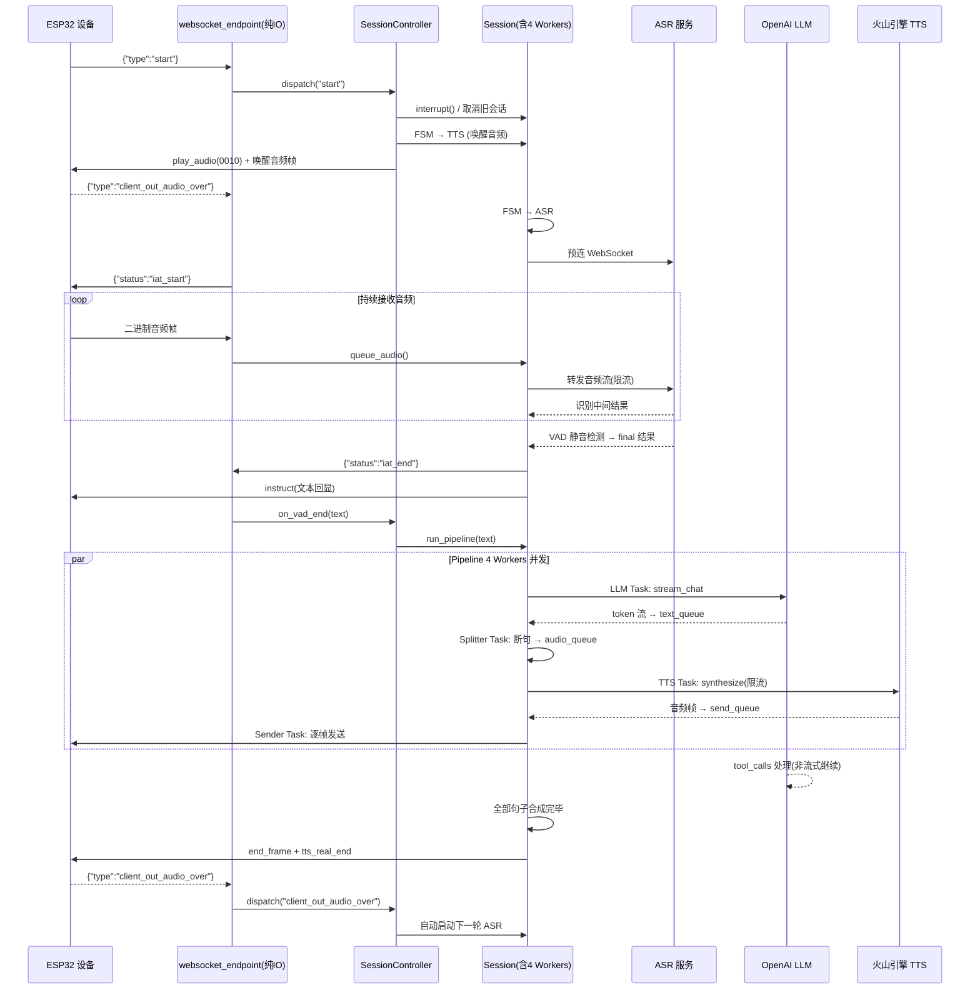
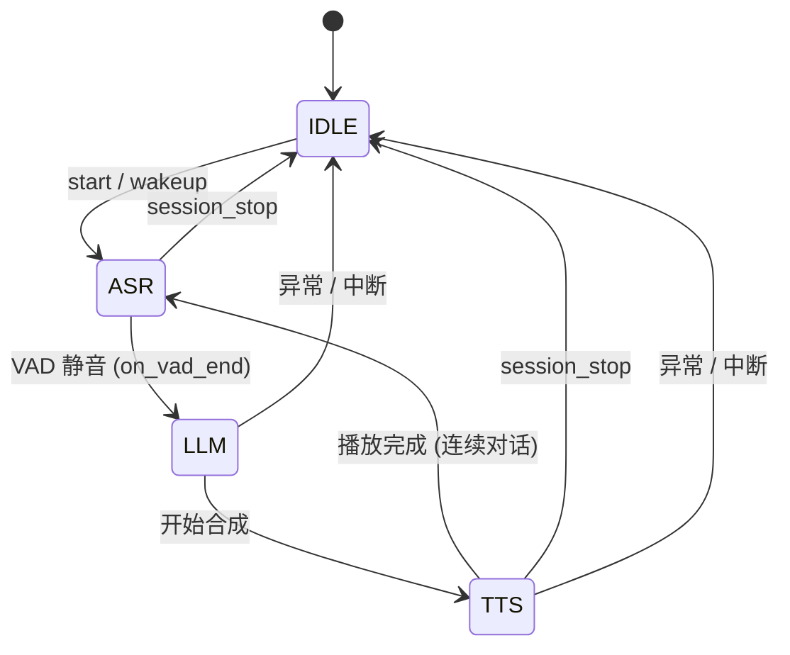
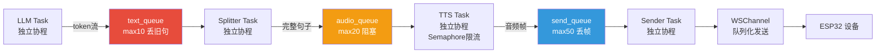

# ESP-AI-Server 架构图（v3 优化版）

## 一、系统架构总览

```mermaid
graph TB
    subgraph 客户端
    ESP[ESP32 设备]
    HTTP[HTTP 客户端]
    end

    subgraph "入口层 entry"
    UV[Uvicorn / FastAPI]
    MW[TraceId 中间件<br/>Prometheus /metrics]
    end

    subgraph "HTTP API 层 app/api/"
    HEALTH[GET /api/health<br/>无需鉴权]
    DEVICES[GET /api/devices]
    DEVICE[GET /api/devices/:id]
    WAKEUP[POST /api/wakeup]
    SPEAK[POST /api/speak]
    end

    subgraph "鉴权层 app/auth/"
    AUTH[require_auth → verify_api_key<br/>Query param: key]
    USERS[users.json<br/>多设备配置]
    ENV[.env 回退]
    end

    subgraph "WebSocket IO 层 app/websocket/"
    HANDLER[websocket_endpoint<br/>纯IO：收消息 + 分发]
    CHANNEL[WSChannel<br/>独立发送协程<br/>队列化]
    FSM[SessionFSM<br/>IDLE→ASR→LLM→TTS]
    end

    subgraph "Session 会话层 app/session/"
    CONTROLLER[SessionController<br/>会话生命周期]
    SESSION[Session 对象<br/>per-device 硬隔离]
    QUEUES[BackpressureQueues<br/>text/audio/send<br/>有损降级]
    LIMITERS[并发限制器<br/>asr_semaphore(5)<br/>tts_semaphore(10)]
    end

    subgraph "设备管理 app/device/"
    REG[DeviceRegistry<br/>设备注册表]
    SPEAKER[speak / wakeup]
    WAKE_AUDIO[WakeAudioManager<br/>唤醒提示音]
    end

    subgraph "ASR 语音识别 app/iat/"
    ASR_FACTORY[ASR 工厂]
    ASR_TENCENT[腾讯云]
    ASR_ALIYUN[阿里云]
    ASR_BYTE[字节跳动]
    ASR_XUNFEI[讯飞]
    AUDIO_PROC[AudioProcessor]
    end

    subgraph "LLM 大模型 app/llm/"
    LLM_FACTORY[LLM 工厂]
    OPENAI[OpenAI LLM<br/>多轮 Function Calling]
    end

    subgraph "TTS 语音合成 app/tts/"
    TTS_FACTORY[TTS 工厂]
    VOLC[火山引擎 TTS<br/>WebSocket 二进制协议]
    VG[VoiceGenerator<br/>帧封装]
    end

    subgraph "流水线 app/pipeline/"
    SPLITTER[SentenceSplitter<br/>实时断句]
    end

    subgraph "工具系统 app/tools/"
    TOOL_MGR[ToolManager<br/>工具注册+发现]
    BUILTIN[内置工具<br/>播放音乐/音量/待机...]
    MCP[MCP Client<br/>外部工具连接]
    CUSTOM[自定义工具]
    end

    subgraph "记忆系统 app/memory/"
    MEMORY[ConversationMemory<br/>消息+Token 双限裁剪]
    end

    subgraph "配置系统"
    CONFIG[app/config.py<br/>Pydantic Settings<br/>.env → 模块级变量]
    end

    %% 连接线
    ESP <-->|WebSocket binary + JSON| HANDLER
    HTTP -->|REST JSON| UV
    UV --> MW
    MW --> HEALTH
    MW --> DEVICES & DEVICE & WAKEUP & SPEAK
    DEVICES & DEVICE & WAKEUP & SPEAK --> AUTH
    AUTH --> USERS
    AUTH -.-> ENV

    HANDLER --> AUTH
    HANDLER -->|创建/获取| CONTROLLER
    CONTROLLER -->|每设备一个| SESSION
    SESSION --> FSM & CHANNEL & QUEUES
    SESSION -.-> MEMORY
    HANDLER --> REG

    QUEUES --> LIMITERS

    SESSION --> ASR_FACTORY & LLM_FACTORY & TTS_FACTORY
    ASR_FACTORY --> ASR_TENCENT & ASR_ALIYUN & ASR_BYTE & ASR_XUNFEI
    LLM_FACTORY --> OPENAI
    TTS_FACTORY --> VOLC
    VOLC --> VG
    OPENAI --> TOOL_MGR
    TOOL_MGR --> BUILTIN & MCP & CUSTOM

    HANDLER --> WAKE_AUDIO
    SPEAKER --> REG
    SPEAKER --> VG
    REG --> CONTROLLER

    CONFIG --> ASR_FACTORY & LLM_FACTORY & TTS_FACTORY & LIMITERS
    USERS --> CONFIG

    style ESP fill:#4a90d9,color:#fff
    style HANDLER fill:#2ecc71,color:#fff
    style SESSION fill:#e74c3c,color:#fff
    style CONTROLLER fill:#9b59b6,color:#fff
    style QUEUES fill:#f39c12,color:#fff
    style FSM fill:#e67e22,color:#fff
    style REG fill:#1abc9c,color:#fff
    style CONFIG fill:#95a5a6,color:#fff
```

---

## 二、分层架构（新）

```
┌──────────────────────────────────────────────────────────────────┐
│                         入口层 (app/main.py)                       │
│  FastAPI + Uvicorn  │  TraceId中间件  │  Prometheus /metrics      │
│  /health/live  /health/ready                                     │
├──────────────────┬───────────────────────────────────────────────┤
│   HTTP API 层     │              WebSocket IO 层（纯收发）          │
│   /api/*          │         websocket_endpoint()                  │
│                   │                                               │
│  devices          │  ┌─ 鉴权 verify_api_key(key)                  │
│  wakeup           │  ├─ WSChannel（独立发送协程）                   │
│  speak            │  ├─ SessionFSM（状态机）                       │
│                   │  └─ 消息循环：只做 receive → dispatch          │
│  鉴权:            │                                               │
│  require_auth     │  IO 层不做任何业务逻辑                          │
│   → Depends       │  所有业务委托给 SessionController              │
├──────────────────┴───────────────────────────────────────────────┤
│                    Session 会话层（关键改造）                       │
│                                                                   │
│  SessionController（会话生命周期管理）                              │
│    └─ Session / device（per-device 硬隔离）                       │
│         ├── FSM           状态机                                  │
│         ├── Context       设备缓冲区 / TTS播放状态                 │
│         ├── Runtime       ASR 生命周期                            │
│         ├── Memory        对话记忆                                │
│         └── BackpressureQueues（3队列 + 有损降级）                  │
│              ├── text_queue (max 10)  丢旧句 → 保留最新            │
│              ├── audio_queue (max 20) 阻塞   → 保证语音完整         │
│              └── send_queue (max 50)  丢帧   → 防止卡死            │
│                                                                   │
│  Pipeline（4个独立协程同时运行）：                                   │
│    LLM Task ──→ text_queue ──→ Splitter Task ──→ audio_queue      │
│    → TTS Task ──→ send_queue ──→ Sender Task ──→ WSChannel → 设备 │
│                                                                   │
│  中断机制：cancel_event.set() → 清空所有队列 → Runtime.reset()     │
│  并发控制：asr_semaphore(5) / tts_semaphore(10)                   │
├──────────────────────────────────────────────────────────────────┤
│                       业务处理层                                   │
│                                                                   │
│  ┌─────────┐    ┌─────────┐    ┌──────────────────────┐         │
│  │   ASR   │    │   LLM   │    │  Pipeline（协程解耦）   │         │
│  │ 腾讯/阿里│ →  │ OpenAI  │ →  │  LLM Task             │         │
│  │ 字节/讯飞│    │ 多轮FC  │    │  Splitter Task        │         │
│  └─────────┘    │ +工具调用│    │  TTS Task             │         │
│                  └────┬────┘    │  Sender Task          │         │
│                       │         └──────────────────────┘         │
│                       ▼                                           │
│              ┌──────────┐                                        │
│              │ 工具系统  │                                        │
│              │ 内置+MCP │                                        │
│              └──────────┘                                        │
├──────────────────────────────────────────────────────────────────┤
│                       基础设施层                                   │
│  ┌──────────┐  ┌──────────┐  ┌─────────┐  ┌────────────────┐   │
│  │ 设备管理  │  │ 对话记忆  │  │ TTS合成  │  │ 配置系统       │   │
│  │ Registry │  │ Memory   │  │ 火山引擎  │  │ .env+users.json│   │
│  │ WakeAudio│  │ Token裁剪 │  │ 帧封装    │  │ per-device覆盖 │   │
│  └──────────┘  └──────────┘  └─────────┘  └────────────────┘   │
└──────────────────────────────────────────────────────────────────┘
```

---

## 三、核心数据流

### 3.1 完整语音对话流程



### 3.2 状态机流转



### 3.3 Pipeline 内部数据流（协程解耦）



---

## 四、模块职责

| 模块 | 路径 | 职责 | 变化 |
|------|------|------|------|
| 入口 | `app/main.py` | FastAPI 创建、中间件、路由注册、Lifespan | ⚡ 适配新 Session 架构 |
| 配置 | `app/config.py` | Pydantic Settings、.env 加载、模块级常量导出 | ⚡ 新增并发/记忆/token配置 |
| HTTP API | `app/api/routes.py` | REST 接口：设备列表、唤醒、说话 | |
| 鉴权 | `app/auth/dependencies.py` | API Key 验证、FastAPI Depends 注入 | |
| **Session 会话** | **`app/session/`** | **新增：per-device 硬隔离 + 背压队列 + 限流** | 🆕 |
| Session控制器 | `app/session/controller.py` | SessionController 会话生命周期管理 | 🆕 |
| Session核心 | `app/session/session.py` | Session 对象、4 Worker Pipeline、中断机制 | 🆕 |
| 背压队列 | `app/session/queues.py` | TextQueue/AudioQueue/SendQueue 有损降级 | 🆕 |
| 并发限制 | `app/session/limiters.py` | ASR(5)/TTS(10) Semaphore 全局限流 | 🆕 |
| 设备管理 | `app/device/` | DeviceRegistry 注册表、speak/wakeup、唤醒音频 | ⚡ 适配 Session 对象 |
| **WebSocket IO** | **`app/websocket/handler.py`** | **纯IO层：消息循环、分发，不做业务** | ⚡ 重构 |
| WebSocket 通道 | `app/websocket/channel.py` | WSChannel 队列发送、SessionFSM 状态机 | |
| WebSocket 上下文 | `app/websocket/context.py` | SessionContext（保留向后兼容） | |
| ASR | `app/iat/` | 腾讯/阿里/字节/讯飞 语音识别 | |
| LLM | `app/llm/` | OpenAI 大模型、多轮 Function Calling | |
| TTS | `app/tts/` | 火山引擎语音合成、帧封装 | |
| Pipeline | `app/pipeline/` | SentenceSplitter、旧worker（保留兼容） | |
| 工具 | `app/tools/` | 内置工具、MCP 外部工具、自动发现 | |
| 记忆 | `app/memory/` | ConversationMemory 消息+Token 双限裁剪 | ⚡ Token限制 |
| 用户 | `app/users/` | 多设备配置加载、DeviceConfig | |
| 日志 | `app/utils/logger.py` | 日志、traceId/sessionId/deviceId 全链路 | ⚡ 新增追踪字段 |

---

## 五、模块依赖关系（新版）

```
main.py
  ├── config.py
  ├── api/routes.py ────── auth/dependencies.py ── users/manager.py
  │                        device/speaker.py ──── device/registry.py
  │                                              device/wake_audio.py ── tts/factory.py
  │                                              tts/voice_generator.py
  └── websocket/handler.py（纯IO层）
        ├── config.py
        ├── auth/dependencies.py
        ├── device/registry.py, wake_audio.py
        ├── tools/tool_manager.py
        ├── session/controller.py ──── session/session.py（核心）
        │                              ├── session/queues.py
        │                              │     text_queue  : drop_oldest (丢旧句)
        │                              │     audio_queue : block       (阻塞)
        │                              │     send_queue  : drop_newest (丢帧)
        │                              ├── session/limiters.py
        │                              │     asr_semaphore(5) / tts_semaphore(10)
        │                              ├── iat/factory.py ── iat/tencent_asr.py
        │                              ├── llm/factory.py ── llm/openai_llm.py
        │                              │                       tools/__init__.py
        │                              ├── tts/factory.py ── tts/volcengine.py
        │                              ├── tts/voice_generator.py
        │                              ├── pipeline/sentence_splitter.py
        │                              ├── memory/memory.py
        │                              └── websocket/channel.py
        └── websocket/channel.py, fsm
```

---

## 六、配置覆盖机制

```
四层配置覆盖链：

┌─────────────────────────────────────────────┐
│  全局配置 (app/config.py, .env 文件)         │
│  ASR_PROVIDER, LLM_MODEL, TTS_TYPE ...      │
├─────────────────────────────────────────────┤
│  ↓ 可被覆盖                                  │
├─────────────────────────────────────────────┤
│  Per-Device 配置 (users.json)               │
│  每个 device_id:                             │
│    asr_provider, llm_model, tts_type ...    │
│    asr_config (按厂商), tts_config           │
│    mcp_servers, rate_limit_rpm ...          │
├─────────────────────────────────────────────┤
│  ↓ 工厂函数合并逻辑                           │
├─────────────────────────────────────────────┤
│  并发控制 (app/config.py .env)               │
│  ASR_MAX_CONCURRENCY=5                     │
│  TTS_MAX_CONCURRENCY=10                    │
├─────────────────────────────────────────────┤
│  ↓ Session 运行时                            │
├─────────────────────────────────────────────┤
│  运行时配置 (create_xxx_processor)            │
│  user_config 优先，fallback 全局配置          │
│  device_id 子覆盖 (model, system_prompt)     │
└─────────────────────────────────────────────┘
```

---

## 七、API 端点一览

| 端点 | 方法 | 鉴权 | 功能 |
|------|------|------|------|
| `/api/health` | GET | 否 | 健康检查 |
| `/health/live` | GET | 否 | 存活检查 |
| `/health/ready` | GET | 否 | 就绪检查（含 ToolManager 状态） |
| `/metrics` | GET | 否 | Prometheus 指标 |
| `/api/devices` | GET | 是 | 列出所有已连接设备 |
| `/api/devices/{device_id}` | GET | 是 | 查询单个设备连接状态 |
| `/api/wakeup` | POST | 是 | 唤醒指定设备 |
| `/api/wakeup/all` | POST | 是 | 唤醒所有设备 |
| `/api/speak` | POST | 是 | 向指定设备 TTS 播放文本 |
| `/api/speak/all` | POST | 是 | 向所有设备 TTS 播放文本 |
| `/` | WebSocket | 是 | 设备长连接端点 |

---

## 八、WebSocket 通信协议

### 8.1 服务端 → 设备

| 消息类型 | 说明 |
|----------|------|
| `play_audio_ws_conntceed` | 连接成功确认 |
| `session_start` | 会话开始 (session_id) |
| `session_status` | 状态变更 (iat_start / iat_end / tts_chunk_start / tts_chunk_end / tts_real_end / session_end) |
| `instruct` | 文本指令（on_iat_cb / on_llm_cb） |
| `play_audio` | 开始播放音频 (tts_task_id) |
| `stc_time` | 时间戳同步 |
| `keepalive` | 心跳 |
| `pong` | 心跳响应 |
| 二进制帧 | 音频数据（4B session_id + 2B status + audio） |

### 8.2 设备 → 服务端

| 消息类型 | 说明 |
|----------|------|
| `start` | 开始语音输入 |
| `iat_end` | 语音输入结束 |
| `play_audio_ws_conntceed` | 设备确认连接就绪 |
| `client_out_audio_over` | 设备音频播放完成 |
| `client_out_audio_ing` | 设备正在播放 |
| `client_available_audio` | 设备缓冲区更新（流控） |
| `session_stop` | 停止当前会话 |
| `ping` | 心跳 |
| `instruct_ack` | 指令确认 |
| 二进制帧 | 麦克风音频数据 |

---

## 九、工具系统

### 内置工具

| 工具名 | 功能 |
|--------|------|
| `get_current_time` | 获取当前时间 |
| `get_current_date` | 获取当前日期 |
| `set_volume` | 设置音量 |
| `volume_up` | 音量+ |
| `volume_down` | 音量- |
| `standby` | 待机 |
| `play_music` | 播放音乐 |
| `test_device` | 测试设备 TTS |

### 扩展方式

- **内置工具**: 在 `app/tools/builtin.py` 中用 `@tool()` 装饰器添加
- **自定义工具**: 在 `app/tools/custom/` 目录下创建 `.py` 文件，用 `@tool()` 装饰器注册
- **MCP 外部工具**: 在 `users.json` 中配置 `mcp_servers`，支持魔搭社区等 MCP Server

---

## 十、新增 `app/session/` 模块详解

### 10.1 背压队列策略

| 队列 | 容量 | 满时策略 | 原因 |
|------|------|----------|------|
| `text_queue` | 10 | **丢弃最旧句子** | 旧句子已经过时，保留最新回复 |
| `audio_queue` | 20 | **阻塞等待** | 必须保证语音完整，不能丢句子 |
| `send_queue` | 50 | **丢弃最新帧** | 防止 WS 发送阻塞拖死整个链路 |

### 10.2 并发控制

| 信号量 | 默认值 | 配置项 | 保护对象 |
|--------|--------|--------|----------|
| `asr_semaphore` | 5 | `ASR_MAX_CONCURRENCY` | ASR WebSocket 发送音频 |
| `tts_semaphore` | 10 | `TTS_MAX_CONCURRENCY` | TTS 火山引擎 API 调用 |

### 10.3 中断机制

```
interrupt():
  1. cancel_event.set()      → 通知所有 Worker 停止
  2. stop_asr()              → 停止 ASR 流
  3. queues.clear_all()      → 清空全部 3 个队列
  4. splitter.reset()        → 重置断句器
  5. runtime.reset()         → 重置 Runtime 状态
  6. set_tts_playing(False)  → 更新播放状态
  7. send end_frame          → 通知设备停止播放
```
