# ESP-AI-Server 架构图

本文档包含 ESP-AI-Server 项目的完整架构图，使用 Mermaid 语法绘制。

---

## 一、整体分层架构

```mermaid
graph TB
    subgraph "Interfaces Layer (接口适配器层)"
        I1["gateways.py (ASR/TTS 网关基类)"]
        I2["asr_gateways.py (ASR 工厂)"]
        I3["llm_gateways.py (LLM 网关)"]
        I4["tts_gateways.py (TTS 网关)"]
        I5["controllers.py (REST 控制器)"]
        I6["presenters.py (输出呈现器)"]
    end

    subgraph "Infrastructure Layer (基础设施层)"
        IF1["web.py (FastAPI 应用)"]
        IF2["config.py (配置管理)"]
        IF3["logging.py (彩色日志)"]
        IF4["connection_pool.py (连接池基类)"]
        IF5["auth.py (认证)"]
        IF6["di_container.py (DI 容器)"]
        IF7["monitoring.py (监控指标)"]
    end

    subgraph "Use Cases Layer (用例层 - 核心业务)"
        U1["session.py (会话核心)"]
        U2["pipeline.py (4-Worker 流水线)"]
        U3["session_fsm.py (状态机+WS通道)"]
        U4["session_management.py (会话管理器)"]
        U5["tools_system.py (工具框架)"]
        U6["builtin_tools.py (内置工具)"]
        U7["custom/ (自定义工具目录)"]
        U8["queues.py (三级背压队列)"]
        U9["voice_generator.py (音频帧生成)"]
        U10["auxiliary_services.py (辅助服务)"]
    end

    subgraph "Domain Layer (领域层 - 最内层)"
        D1["entities.py (实体)"]
        D2["exceptions.py (领域异常)"]
        D3["repositories.py (仓储接口)"]
        D4["services.py (领域服务接口)"]
        D5["value_objects.py (值对象)"]
    end

    %% 依赖关系（外层依赖内层）
    U1 --> D1
    U1 --> D2
    U1 --> D3
    U1 --> D4
    U1 --> D5
    
    U2 --> D1
    U2 --> D2
    
    U3 --> D1
    U3 --> IF3
    
    U5 --> D1
    U5 --> D2
    U5 --> IF3
    U5 --> IF2
    
    U6 --> U5
    U7 --> U5
    
    U10 --> D1
    U10 --> D2
    U10 --> IF2
    U10 --> IF3
    
    I1 --> D1
    I1 --> D2
    I1 --> D3
    I1 --> IF4
    I1 --> IF3
    
    I2 --> I1
    I3 --> D1
    I3 --> D2
    I3 --> D3
    I4 --> I1
    
    I5 --> U1
    I5 --> U2
    I5 --> U5
    
    IF1 --> I1
    IF1 --> I2
    IF1 --> I3
    IF1 --> I4
    IF1 --> U1
    IF1 --> U2
    IF1 --> U3
    IF1 --> U5
    IF1 --> U10
    IF1 --> IF2
    IF1 --> IF3
```

---

## 二、核心数据流向图

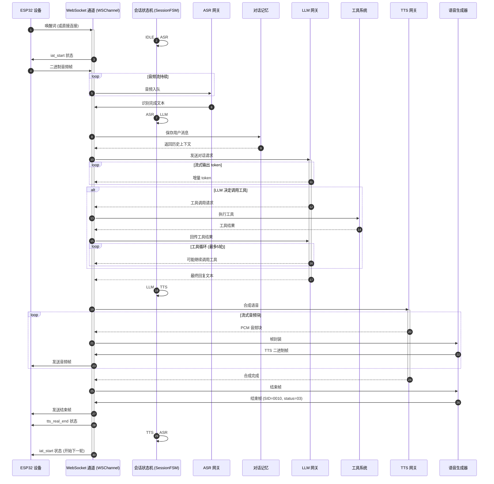

---

## 三、会话状态机

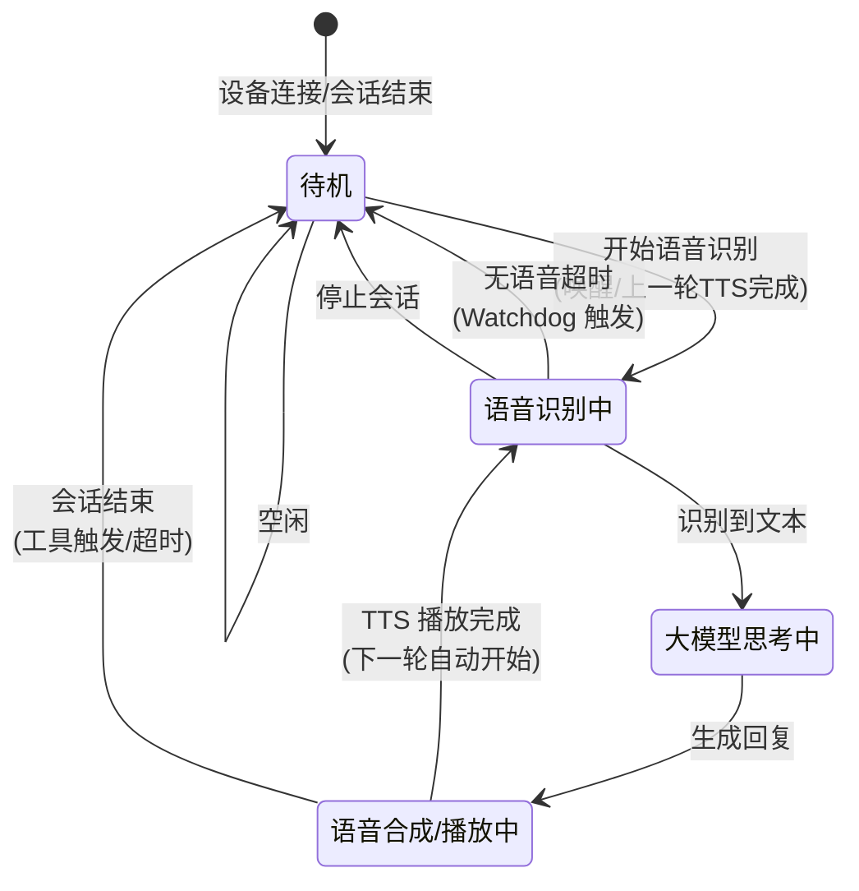

---

## 四、4-Worker 并发流水线

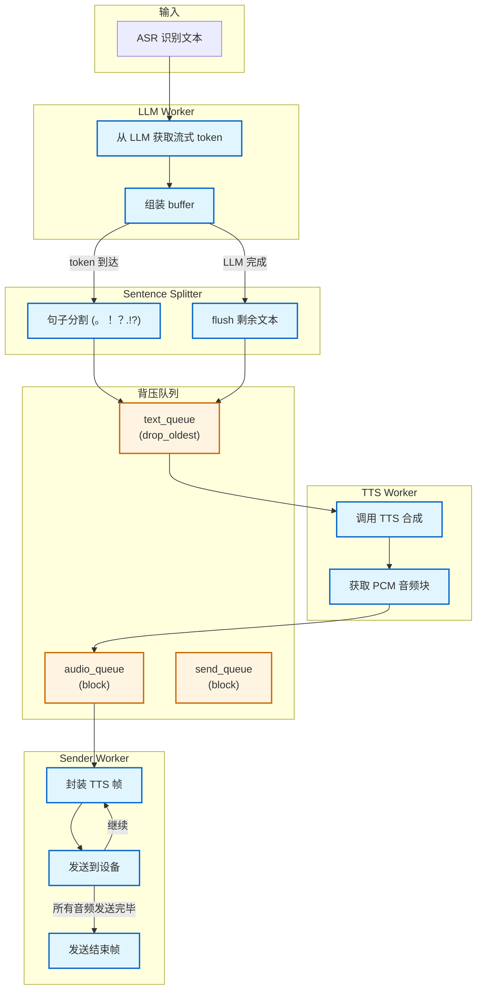

---

## 五、完整会话生命周期

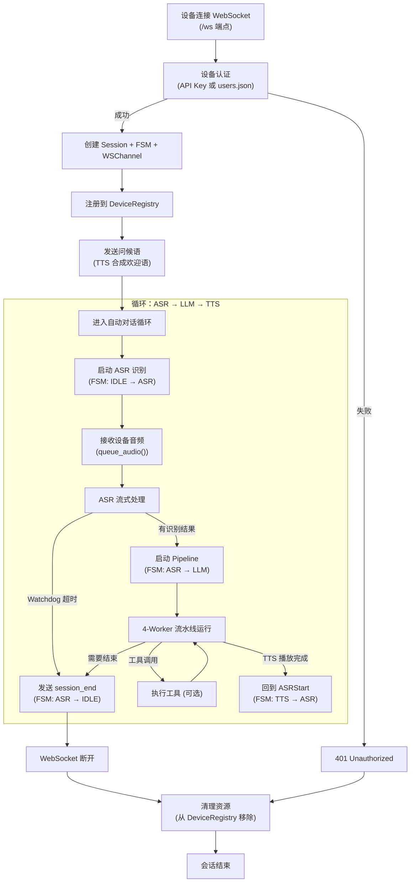

---

## 六、工具系统架构

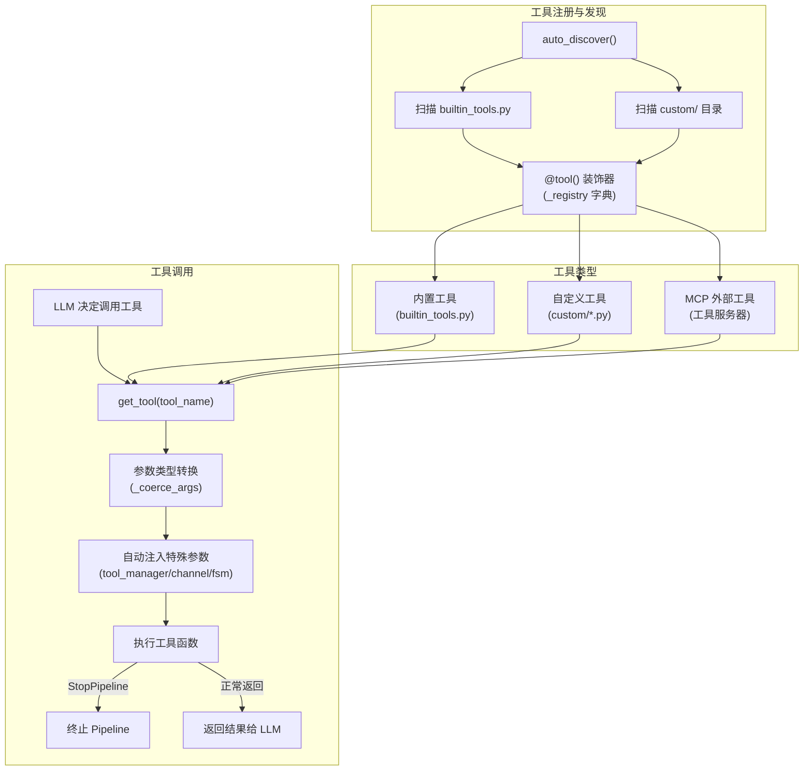

---

## 七、目录结构树

```
src/
├── main.py                          # 入口点
├── domain/
│   ├── __init__.py
│   ├── entities.py                  # 实体定义
│   │   ├── SessionState
│   │   ├── Session
│   │   ├── Device
│   │   ├── Conversation
│   │   ├── Message
│   │   └── ToolCall
│   ├── exceptions.py                # 领域异常层级
│   ├── repositories.py              # 仓储接口
│   ├── services.py                  # 领域服务接口
│   └── value_objects.py             # 值对象
├── use_cases/
│   ├── __init__.py
│   ├── session.py                   # 会话核心
│   │   ├── SessionRuntime
│   │   ├── Session
│   │   └── Watchdog
│   ├── pipeline.py                  # 4-Worker 流水线
│   │   ├── SentenceSplitter
│   │   ├── PipelineConfig
│   │   └── ConversationPipeline
│   ├── session_fsm.py               # 状态机 + WS通道
│   │   ├── SessionFSM
│   │   └── WSChannel
│   ├── session_management.py        # 会话管理器
│   ├── tools_system.py              # 工具框架
│   │   ├── @tool() 装饰器
│   │   ├── PerUserToolManager
│   │   └── auto_discover()
│   ├── builtin_tools.py             # 内置工具
│   ├── custom/                      # 自定义工具目录
│   │   ├── __init__.py
│   │   └── example.py
│   ├── queues.py                    # 三级背压队列
│   ├── voice_generator.py           # 音频帧生成器
│   ├── auxiliary_services.py        # 辅助服务
│   │   ├── DeviceRegistry
│   │   ├── WakeAudioManager
│   │   ├── EmotionDetector
│   │   ├── EmotionRenderer
│   │   ├── ImageSender
│   │   ├── ConversationMemory
│   │   └── Speaker
│   ├── dtos.py
│   └── ports.py
├── infrastructure/
│   ├── __init__.py
│   ├── web.py                       # FastAPI 应用
│   ├── config.py                    # 配置管理
│   ├── logging.py                   # 彩色日志系统
│   ├── connection_pool.py           # 连接池基类
│   ├── auth.py                      # 认证
│   ├── di_container.py              # DI 容器
│   └── monitoring.py                # 监控指标
└── interfaces/
    ├── __init__.py
    ├── gateways.py                  # ASR 网关基类
    ├── asr_gateways.py              # ASR 工厂
    ├── llm_gateways.py              # LLM 网关
    ├── tts_gateways.py              # TTS 网关
    ├── controllers.py               # REST 控制器
    └── presenters.py                # 输出呈现器
```

---

## 八、WebSocket 消息交换时序

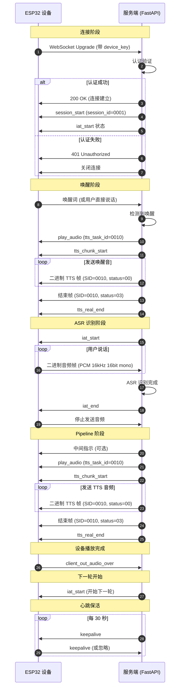

---

## 九、工具循环调用图

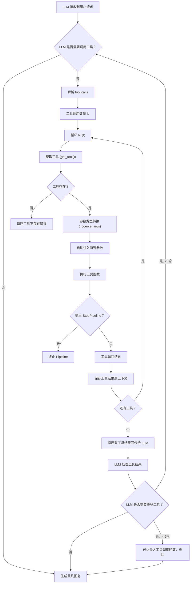

---

## 十、ASR 连接池与预热

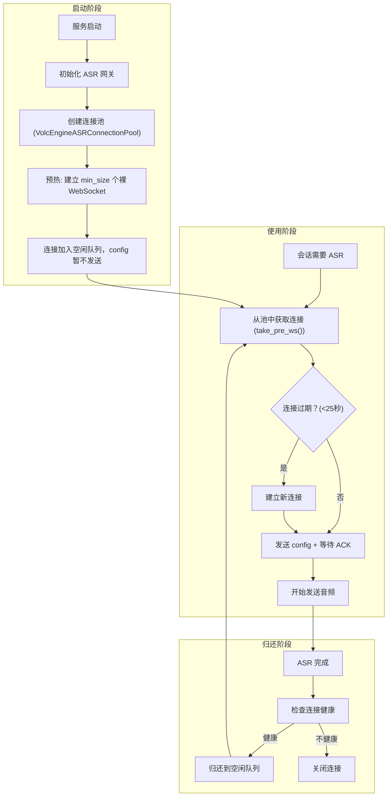

---

## 十一、音频帧格式

```mermaid
graph TB
    subgraph "TTS 数据帧"
        A1["字节 0-3"] -->|UTF-8| A2["会话ID<br/>(\"0010\" = TTS)"]
        A3["字节 4-5"] -->|UTF-8| A4["状态码<br/>(\"00\" = 正常数据)"]
        A5["字节 6+"] --> A6["PCM 音频数据<br/>(16kHz, 16bit, mono)"]
    end

    subgraph "TTS 结束帧"
        B1["字节 0-3"] -->|UTF-8| B2["会话ID<br/>(\"0010\" = TTS)"]
        B3["字节 4-5"] -->|UTF-8| B4["状态码<br/>(\"03\" = 结束)"]
    end

    subgraph "连接/问候帧"
        C1["字节 0-3"] -->|UTF-8| C2["会话ID<br/>(\"0001\" = CONNECTED)"]
        C3["字节 4-5"] -->|UTF-8| C4["状态码<br/>(\"00\" = 正常数据)"]
    end

    style A6 fill:#e1f5ff,stroke:#0066cc,stroke-width:2px
    style B4 fill:#c8e6c9,stroke:#2e7d32,stroke-width:2px
    style C2 fill:#fff4e1,stroke:#cc6600,stroke-width:2px
```

---

## 十二、Watchdog 超时检测

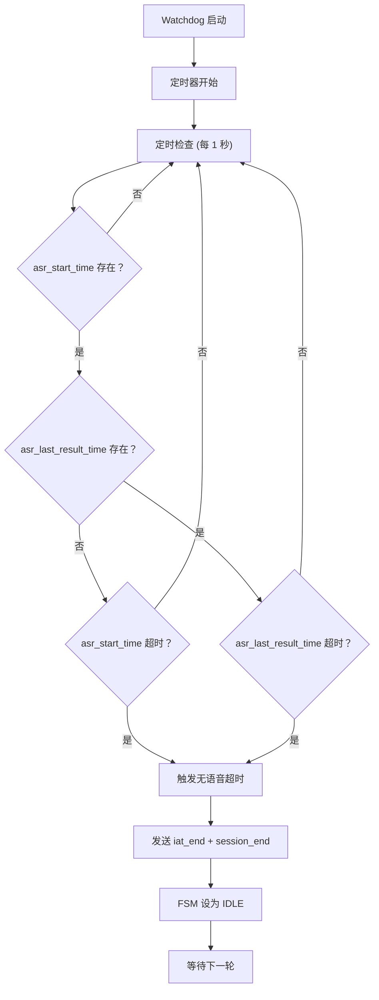

---

## 十三、文件依赖关系简图

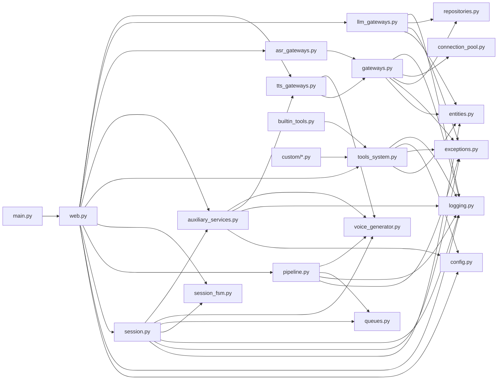
